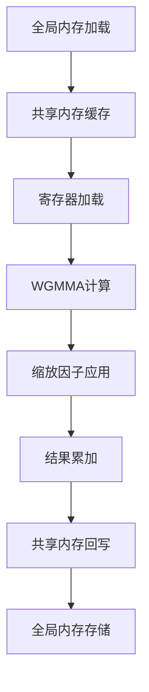
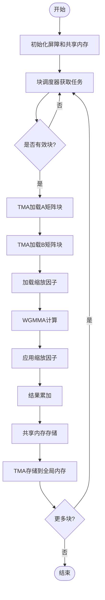

# GEMM算子代码分析总结报告

## 一、算子基本信息确认

### 1.1 代码来源与环境
- **框架类型**: CUDA C++ 原生实现
- **硬件平台**: NVIDIA GPU Hopper架构 (SM90)
- **计算库依赖**: 
  - CUTLASS (NVIDIA高性能矩阵计算库)
  - CUTE (CUDA Templates for Tensor Algebra)
- **编译要求**: CUDA架构版本≥900 (`__CUDA_ARCH__ >= 900`)
- **数据类型**: FP8 (8位浮点) 计算，支持E4M3格式

### 1.2 功能定位
- **基础功能**: 通用矩阵乘法 (GEMM) C = αAB + βC
- **扩展功能**: 
  - 支持分组矩阵乘法 (MGroupedMasked)
  - 支持FP8混合精度计算
  - 支持1D×2D矩阵乘法
  - 支持缩放因子应用

## 二、输入输出分析

### 2.1 输入参数解析

#### 2.1.1 矩阵参数
- **矩阵A**: 
  - 形状: [M, K] 维度
  - 数据类型: `__nv_fp8_e4m3` (8位浮点)
  - 内存布局: 行优先存储
- **矩阵B**: 
  - 形状: [K, N] 维度
  - 数据类型: `__nv_fp8_e4m3` (8位浮点)
  - 内存布局: 行优先存储
- **矩阵C**: 
  - 形状: [M, N] 维度
  - 数据类型: `__nv_bfloat16` (16位脑浮点)
  - 内存布局: 行优先存储

#### 2.1.2 缩放因子
- **sfa**: A矩阵的缩放因子，形状为[M]，类型为float32
- **sfb**: B矩阵的缩放因子，形状为[ceil_div(K, 128), ceil_div(N, 128)]，类型为float32
- **grouped_layout**: 分组布局信息，int类型数组

#### 2.1.3 辅助参数
- **shape_m/shape_n/shape_k**: 矩阵的实际维度
- **BLOCK_M/BLOCK_N/BLOCK_K**: 分块大小参数
- **kNumGroups**: 分组数量

### 2.2 输出参数解析
- **输出矩阵**: 直接写入输入矩阵C的内存空间
- **数据类型转换**: 从FP8计算结果转换为BF16输出
- **内存布局**: 保持与输入矩阵C相同的行优先布局

## 三、计算流程分析

### 3.1 矩阵切割（分块）策略

#### 3.1.1 分块层级结构
```
全局矩阵 → 线程块(Block) → Warp组 → 线程
```

#### 3.1.2 分块尺寸设计
- **BLOCK_M**: 128 (主分块)
- **BLOCK_N**: 128 (主分块)
- **BLOCK_K**: 128 (固定值，用于FP8缩放)
- **WAVE_BLOCK_M**: 64或128 (基于WGMMA单元)

#### 3.1.3 分块分配方式
- **调度器**: `Scheduler<kGemmType>`类负责持久化调度
- **负载均衡**: 支持TMA多播(kNumTMAMulticast)优化负载分配
- **分组处理**: 支持MGroupedMasked模式的分组矩阵乘法

### 3.2 核心计算过程

#### 3.2.1 计算单元映射
- **最小计算单元**: WGMMA (Warpgroup Matrix Multiply Accumulate)
- **WGMMA尺寸**: 64×64×16 (M×N×K)
- **线程组织**: 128线程的Warpgroup执行矩阵乘法

#### 3.2.2 计算步骤流程


#### 3.2.3 数据流路径
1. **加载阶段**: TMA (Tensor Memory Accelerator) 异步加载
2. **计算阶段**: WGMMA指令执行矩阵乘法
3. **缩放阶段**: 应用FP8缩放因子进行反量化
4. **存储阶段**: TMA异步存储结果

### 3.3 数据排布与流转

#### 3.3.1 内存层次结构
- **全局内存**: 原始矩阵数据
- **共享内存**: 分块缓存 + 双缓冲机制
- **寄存器**: WGMMA计算工作区

#### 3.3.2 共享内存布局
```
共享内存布局:
[SMEM_D_SIZE]         // 输出缓冲区
[SMEM_A_SIZE] * kNumStages  // A矩阵双缓冲
[SMEM_B_SIZE] * kNumStages  // B矩阵双缓冲
[SMEM_SFA_SIZE] * kNumStages // A缩放因子
[SMEM_SFB_SIZE]        // B缩放因子
[Barrier结构体]        // 同步屏障
```

#### 3.3.3 数据重排策略
- **Swizzling**: 支持128字节对齐的swizzling模式
- **Bank Conflict避免**: 通过地址计算避免共享内存bank冲突
- **向量化访问**: 使用STSM (Shared Memory Store) 进行向量化存储

## 四、优化方法识别与分析

### 4.1 硬件适配优化

#### 4.1.1 内存访存优化
- **TMA异步加载**: 使用Tensor Memory Accelerator进行异步数据传输
- **双缓冲机制**: kNumStages=3或4的pipeline并行
- **预取策略**: TMA描述符预取 (`prefetch_tma_descriptor`)
- **合并访存**: 128字节对齐的合并访问模式

#### 4.1.2 计算单元利用
- **WGMMA指令**: 专门针对Hopper架构的矩阵乘法指令
- **Tensor Core利用**: 通过WGMMA接口使用Tensor Core单元
- **寄存器优化**: 精确控制寄存器分配 (kNumMathRegisters=232)

#### 4.1.3 线程模型优化
- **持久化线程**: 使用while循环进行块级调度
- **Warp分组**: TMA warp-group和Math warp-group分离
- **同步机制**: 使用ClusterTransactionBarrier进行高效同步

### 4.2 算法与数学优化

#### 4.2.1 分块策略优化
- **多级分块**: 全局分块 + WGMMA子分块
- **动态分块**: 支持非对齐维度的处理
- **负载均衡**: TMA多播优化计算资源利用

#### 4.2.2 数值精度优化
- **混合精度**: FP8输入 → FP32累加 → BF16输出
- **缩放机制**: 每128通道的FP8缩放因子
- **数值稳定性**: 使用FP32进行中间累加避免溢出

#### 4.2.3 冗余计算消除
- **条件计算**: 跳过无效计算块 (`skip_computation`)
- **边界处理**: 非对齐维度的特殊处理
- **Early Exit**: 对无效块的提前退出机制

### 4.3 工程实现优化

#### 4.3.1 循环优化
- **循环展开**: #pragma unroll 展开关键循环
- **Pipeline优化**: 计算与访存重叠
- **分支优化**: 编译时条件分支消除

#### 4.3.2 数据复用
- **共享内存复用**: A/B矩阵分块在共享内存中复用
- **寄存器复用**: WGMMA累加器寄存器复用
- **缩放因子缓存**: B缩放因子在共享内存中缓存

#### 4.3.3 异步操作
- **计算-访存重叠**: TMA加载与WGMMA计算并行
- **异步屏障**: 使用ClusterTransactionBarrier实现异步同步
- **流水线并行**: 多阶段pipeline实现指令级并行

## 五、工作流程总结

### 5.1 完整执行流程



### 5.2 关键实现位置

| 优化方法 | 代码位置 | 作用说明 |
|---------|----------|----------|
| TMA异步加载 | `tma_copy`函数调用 | 实现全局内存到共享内存的高效传输 |
| WGMMA计算 | `WGMMA::wgmma`方法 | 使用Tensor Core进行矩阵乘法 |
| 双缓冲机制 | `kNumStages`模板参数 | 实现计算与数据传输的并行 |
| 缩放因子应用 | 缩放乘法操作 | FP8反量化计算 |
| 共享内存Swizzling | 地址计算逻辑 | 避免bank冲突，提高访问效率 |
| 持久化调度 | `while(scheduler.get_next_block())` | 提高GPU利用率 |

### 5.3 性能特征总结

- **计算密度**: 高计算密度，充分利用Tensor Core
- **内存带宽**: 通过TMA和双缓冲优化内存带宽利用
- **并行度**: 支持大规模并行，可配置线程块数量
- **可扩展性**: 支持不同矩阵尺寸和分组配置
- **精度**: 混合精度计算平衡性能与精度